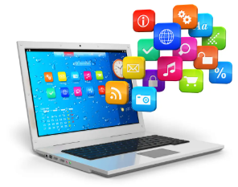

# El computador digital moderno

## ¿Qué es un computador?

Un computador es una máquina electrónica programable que procesa, almacena y transmite información mediante hardware (componentes físicos) y software (programas e instrucciones).

## Arquitecturas de un computador

La arquitectura de un computador es el diseño que define la organización e interacción del hardware y software para procesar datos.
Algunas de estas son:

### Arquitectura CISC:
La arquitectura CISC usa instrucciones largas y detalladas para hacer varias tareas a la vez, lo que reduce la cantidad de pasos en un programa. Sin embargo, esto hace que el procesador sea más complejo y consuma más energía. También tiene menos espacio para guardar información temporal y usa registros especiales para ciertas funciones, como manejar interrupciones. Ejemplos de esta arquitectura son los procesadores Intel x86 y AMD64.
### Arquitectura RISC:
La arquitectura RISC usa instrucciones simples y rápidas, optimizando el rendimiento y el consumo de energía. Su pipelining permite hacer varias tareas a la vez, acelerando el proceso. Requiere más RAM y usa menos transistores. Ejemplo: procesadores ARM en móviles.

## Hardware

El hardware es la parte física de un computador, incluyendo todos sus componentes que permiten su funcionamiento. los elementos de hardware funcionan de manera conjunta para procesar, almacenar, analizar y transmitir información.Algunos tipos son:

### CPU (Unidad Central de Procesamiento)

Es el "cerebro" del computador, encargado de ejecutar instrucciones y procesar datos. Sus partes principales son:

**ALU (Unidad Aritmético-Lógica)**: Realiza operaciones matemáticas (sumas, restas, etc.) y lógicas (comparaciones).

**Unidad de control**: Coordina las actividades de la CPU, gestionando el flujo de datos y las instrucciones.

**Registros**: Pequeñas memorias ultrarrápidas dentro de la CPU que almacenan datos temporales para su procesamiento.

**Buses**: Canales de comunicación que permiten el intercambio de datos entre la CPU y otros componentes (memoria, dispositivos, etc.).
###  GPU (Unidad de Procesamiento Gráfico)
Es un procesador especializado en manejar operaciones gráficas y tareas paralelas, la GPU tiene miles de núcleos pequeños que trabajan simultáneamente, lo que la hace ideal para:

-Renderizar gráficos en videojuegos.

-Procesamiento de imágenes y videos.

-Cálculos científicos y de inteligencia artificial.

**Comparación CPU vs GPU:**

**CPU**: Es versátil y maneja tareas generales, pero con menos núcleos (4, 8, 16, etc.).

**GPU**: Está optimizada para tareas paralelas y gráficas, con miles de núcleos pequeños.
### Memoria 

Es donde se almacenan datos e instrucciones. Existen varios tipos:

**Registros**: Memorias ultrarrápidas dentro de la CPU, usadas para almacenar datos temporales.

**Caché**: Memoria rápida que almacena datos frecuentes para acelerar el acceso (L1, L2, L3).

**Principal** (RAM): Memoria volátil que almacena datos e instrucciones mientras el sistema está encendido.

**Secundaria**: Almacenamiento no volátil, como discos duros (HDD), unidades de estado sólido (SSD) y dispositivos externos (USB, discos externos).

### Dispositivos de entrada/salida

Permiten la interacción entre el usuario y el sistema. Algunos ejemplos son:

**Entrada**: Teclado, mouse, micrófono, escáner.

**Salida**: Monitor, impresora, altavoces.

**Entrada/Salida**: Pantallas táctiles, discos duros externos.

### Buses de datos

Son canales que permiten la transferencia de datos entre los componentes del sistema. Los más importantes son:

**Bus de datos**: Transfiere datos entre la CPU, memoria y dispositivos.

**Bus de direcciones**: Indica la ubicación de los datos en la memoria.

**Bus de control**: Gestiona las operaciones y la sincronización entre componentes.

### Tarjeta madre (Motherboard)

 Conecta todos los componentes del sistema.

 

### Fuente de poder

 Suministra energía al sistema.

 

## Software 

El software es un conjunto de programas, datos, instrucciones y procedimientos que permiten realizar tareas específicas en un sistema informático. Se divide en tres categorías:

**Software de sistema**: es necesario para que el hardware funcione correctamente.

**Software de aplicación**: se utiliza para realizar tareas específicas en un ordenador.

**Software de desarrollo**: se utiliza para crear programas y aplicaciones.

## Funcionamiento del computador

### Procesos al encender una computadora

Cuando enciendes una computadora, ocurren varios pasos:

**BIOS/UEFI**: Se activa el sistema básico de entrada y salida, que verifica el hardware.

**POST (Power-On Self Test)**: Se revisa que todos los componentes funcionen correctamente.

**Carga del sistema operativo**: Se encuentra en el disco y se carga en la memoria RAM.

**Listo para usar**: Aparece la pantalla de inicio y el sistema está preparado para recibir comandos.

### Desde que ingreso un dato hasta que veo el resultado

-Presionas una tecla → El teclado envía una señal eléctrica al procesador.

-La CPU interpreta la señal y busca la acción correspondiente.

-Si es un cálculo, el procesador lo realiza y envía el resultado a la memoria RAM.

-La tarjeta gráfica procesa la información y la muestra en la pantalla.

### Codificación de datos internamente

Los datos en el computador se representan en binario (0 y 1). Cada letra, número o imagen se convierte en una secuencia de estos valores, que el procesador entiende y manipula para ejecutar operaciones.

### Unidades de medida de datos

Bit: Unidad básica de información en el ámbito digital, representando un valor binario de 0 o 1.

Byte: Conjunto de 8 bits (representa un carácter).

Kilobyte (KB): 1,024 bytes.

Megabyte (MB): 1,024 KB.

Gigabyte (GB): 1,024 MB.

Terabyte (TB): 1,024 GB.

### Mapa conceptual

**Cybergrafía**

https://mefics.org/es/qu%C3%A9-es-la-arquitectura-risc-y-cisc-con-sus-ventajas-y-desventajas/

https://concepto.de/software-de-aplicacion/

https://alfabetismodigital.com/que-es-un-mega-bit-byte-kilo-giga-y-mas-unidades/

**mapa coceptual**: https://www.canva.com/design/DAGeWLQ3HyU/wPAslUjSX0yu7olhjaGSKw/view?utm_content=DAGeWLQ3HyU&utm_campaign=designshare&utm_medium=link&utm_source=publishsharelink&mode=preview
