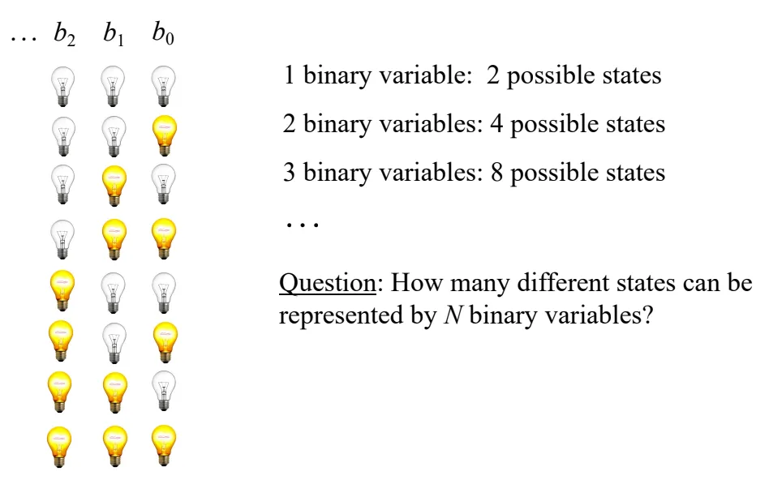
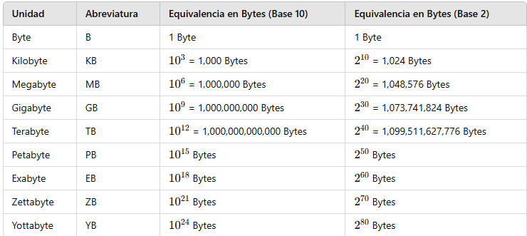
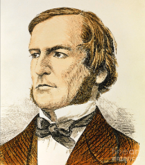
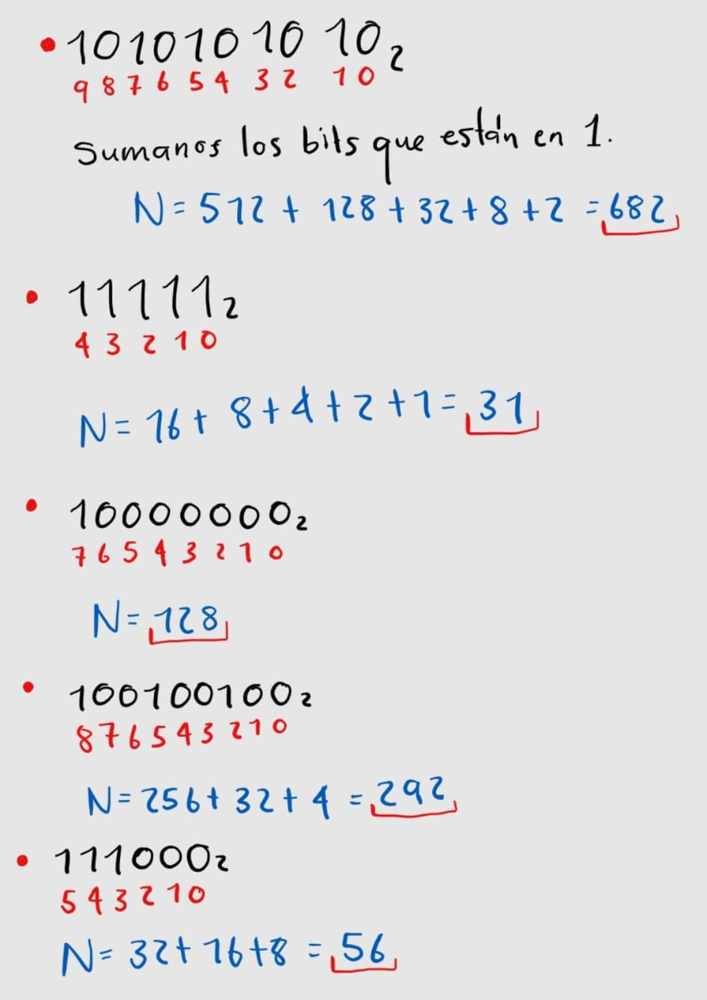
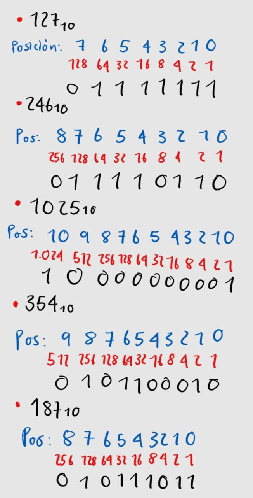
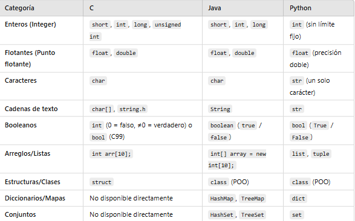
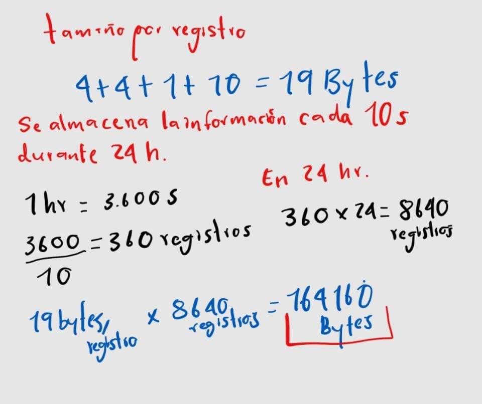

# Representación de datos digitales

## ¿Cómo se representan los datos en una computadora?

Los datos en una computadora se representan mediante el sistema binario, utilizando solo dos estados: 0 y 1. Cualquier tipo de información, como números, letras, imágenes o sonidos, se convierte en secuencias de bits 

## ¿Cuántos estados diferentes se pueden representar usando N bits?

La cantidad de estados diferentes que se pueden representar con N variables binarias es 2 a la N

## ¿Cuáles son las unidades de almacenamiento de datos que se utilizan en computación? 

# George Boole
                                                                            
                                                            
                                                                                     

George Boole creó el álgebra booleana, un sistema basado en 0 y 1 que es la base de la informática. Gracias a su trabajo, las computadoras pueden tomar decisiones y procesar información, permitiendo el funcionamiento de circuitos, programas y operaciones lógicas.

## 📤 Ejercicio 2 

### De binarios a decimales:

### De decimales a binarios:

## Tipos de datos en diferentes lenguajes de programación

## Cálculo de espacio en memoria
Usaremos el lenguaje de programación C, ya que C es el más eficiente en cuanto a memoria, ya que los tamaños de los tipos de datos son fijos y compactos.

## Conclusión

En esta actividad aprendí cómo las computadoras representan y almacenan diferentes tipos de datos utilizando el sistema binario. Comprendí que los datos, ya sean números, texto o imágenes, deben convertirse a secuencias de bits para que la computadora pueda procesarlos. También entendí que el espacio en memoria que ocupa un dato depende de su tipo y del lenguaje de programación utilizado.

Además, aprendí a convertir números entre los sistemas decimal y binario, lo que me ayudó a visualizar cómo las computadoras interpretan la información numérica. Me pareció interesante descubrir cómo la lógica booleana es la base de las decisiones computacionales y cómo los bits y bytes forman la estructura fundamental de la informática.

Finalmente, realizar los cálculos de almacenamiento de datos me permitió comprender la importancia de la optimización en la gestión de memoria, especialmente en sistemas donde el espacio es limitado.
