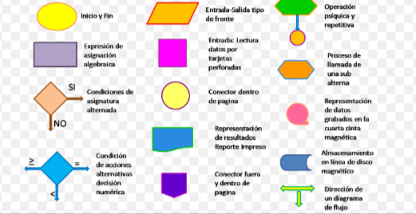
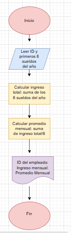
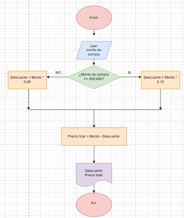
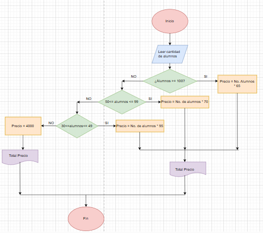

## 📤 Ejercicio 1.

Los diagramas de flujo son herramientas visuales utilizadas para representar algoritmos o procesos. Cada operación en un algoritmo se representa con un símbolo específico, lo que facilita la comprensión del flujo de trabajo. A continuación, se describen los símbolos más comunes utilizados en los diagramas de flujo, basados en fuentes confiables como normas ISO y estándares ampliamente aceptados:

**Óvalo (Elipse)**:

**Función**: Representa el inicio o el fin de un proceso.

**Uso**: Se coloca al principio y al final del diagrama de flujo.

**Ejemplo**: "Inicio" o "Fin".

**Rectángulo**:

**Función**: Representa una acción o proceso.

**Uso**: Se utiliza para indicar una operación o paso en el algoritmo.

**Ejemplo**: "Calcular suma" o "Mostrar resultado".

**Rombo**:

**Función**: Representa una decisión o condición.

**Uso**: Se utiliza para preguntas que tienen dos posibles respuestas (Sí/No, Verdadero/Falso).

**Ejemplo: "¿Es mayor que 10?".

**Flecha**:

**Función**: Representa la dirección del flujo del proceso.

**Uso**: Conecta los símbolos y muestra el orden en que se ejecutan las operaciones.

**Ejemplo**: Conectar "Inicio" con la primera acción.

**Paralelogramo**:

**Función**: Representa la entrada o salida de datos.

**Uso**: Se utiliza para indicar la lectura de datos (entrada) o la impresión de resultados (salida).

**Ejemplo**: "Leer número" o "Mostrar mensaje".

**Círculo**:

**Función**: Representa un conector dentro de la misma página.

**Uso**: Se utiliza para unir flujos que no caben en una sola página o para evitar cruces de líneas.

**Ejemplo**: Conectar dos partes del diagrama sin dibujar una línea larga.

**Rectángulo con líneas verticales dobles**:

**Función**: Representa un proceso predefinido o subrutina.

**Uso**: Se utiliza para indicar una operación que está definida en otro lugar.

**Ejemplo**: "Llamar a función X".

**Triángulo**:

**Función**: Representa un archivo o almacenamiento.

**Uso**: Se utiliza para indicar la lectura o escritura de datos en un archivo.

**Ejemplo**: "Guardar en archivo".

**Hexágono**:

**Función**: Representa un proceso de preparación o inicialización.

**Uso**: Se utiliza para indicar la configuración inicial o preparación de datos.

**Ejemplo**: "Inicializar variables".

## 📤 Ejercicio 2.

Construye un algoritmo que, al recibir como datos el ID del empleado y los seis primeros sueldos del año, calcule el ingreso total semestral y el promedio mensual, e imprima el ID del empleado, el ingreso total y el promedio mensual.

### Pseudocódigo

**Inicio**
   // Paso 1: Leer el ID del empleado.
   Leer ID

   // **Paso 2**: Leer los seis sueldos.
   Leer Sueldo1
   Leer Sueldo2
   Leer Sueldo3
   Leer Sueldo4
   Leer Sueldo5
   Leer Sueldo6

   // **Paso 3**: Calcular el ingreso total semestral.
   IngresoTotal = Sueldo1 + Sueldo2 + Sueldo3 + Sueldo4 + Sueldo5 + Sueldo6

   // **Paso 4**: Calcular el promedio mensual.
   PromedioMensual = IngresoTotal / 6

   // **Paso 5**: Mostrar los resultados.
   Mostrar "ID del empleado: ", ID
   Mostrar "Ingreso total semestral: ", IngresoTotal
   Mostrar "Promedio mensual: ", PromedioMensual
**Fin**

## Ejercicios

1. Realice un algoritmo para determinar cuánto se debe pagar por equis cantidad de lápices considerando que si son 1000 o más el costo es de $85 cada uno; de lo contrario, el precio es de $90. Represéntelo con el pseudocódigo y el diagrama de flujo.
### Pseudocódigo

INICIO

    ESCRIBIR "Ingrese la cantidad de lápices:"
    LEER cantidad
    SI cantidad >= 1000 ENTONCES
        precio ← 85
    SINO
        precio ← 90
    FIN SI
    total ← cantidad * precio
    ESCRIBIR "El total a pagar es: ", total
FIN

2. Un almacén de ropa tiene una promoción: por compras superiores a $250 000 se les aplicará un descuento de 15%, de caso contrario, sólo se aplicará un 8% de descuento. Realice un algoritmo para determinar el precio final que debe pagar una persona por comprar en dicho almacén y de cuánto es el descuento que obtendrá. Represéntelo mediante el pseudocódigo y el diagrama de flujo.
 
### Pseudocódigo

INICIO

    ESCRIBIR "Ingrese el total de la compra:"
    LEER total_compra
    SI total_compra > 250000 ENTONCES
        descuento ← total_compra * 0.15
    SINO
        descuento ← total_compra * 0.08
    FIN SI
    precio_final ← total_compra - descuento
    ESCRIBIR "El descuento aplicado es: ", descuento
    ESCRIBIR "El precio final a pagar es: ", precio_final
FIN

3. El director de una escuela está organizando un viaje de estudios, y requiere determinar cuánto debe cobrar a cada alumno y cuánto debe pagar a la compañía de viajes por el servicio. La forma de cobrar es la siguiente: si son 100 alumnos o más, el costo por cada alumno es de $65.00; de 50 a 99 alumnos, el costo es de $70.00, de 30 a 49, de $95.00, y si son menos de 30, el costo de la renta del autobús es de $4000.00, sin importar el número de alumnos.

### Pseudocódigo

INICIO

    ESCRIBIR "Ingrese la cantidad de alumnos:"
    LEER cantidad_alumnos
    
    SI cantidad_alumnos >= 100 ENTONCES
        costo_por_alumno ← 65
        total_pagar ← cantidad_alumnos * costo_por_alumno
    SINO SI cantidad_alumnos >= 50 ENTONCES
        costo_por_alumno ← 70
        total_pagar ← cantidad_alumnos * costo_por_alumno
    SINO SI cantidad_alumnos >= 30 ENTONCES
        costo_por_alumno ← 95
        total_pagar ← cantidad_alumnos * costo_por_alumno
    SINO
        total_pagar ← 4000
        costo_por_alumno ← total_pagar / cantidad_alumnos
    FIN SI

    ESCRIBIR "El costo por alumno es: ", costo_por_alumno
    ESCRIBIR "El total a pagar a la compañía de viajes es: ", total_pagar
FIN

