# Problemas
1. 

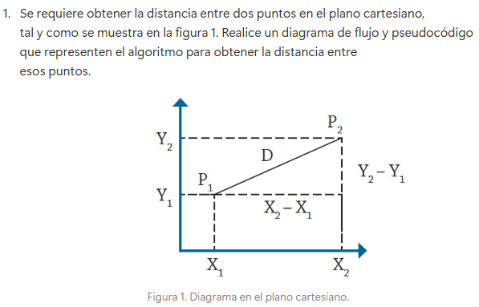

## Pasos:
 **1-** Pedir los puntos, inicial (x1,y1) y final (x2,y2)

 **2-** Obtener componentes x y y de la distancia (dx, dy), para eso restamos (x2-x1) y (y2-y1)

 **3-** Sacar raiz cuadrada a la suma de  las componentes al cuadrado (dx^2 + dy^2)^1/2

 **4-** Imprimir distancia

### Diagrama de flujo

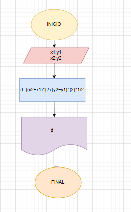

### Pseudocódigo

Inicio

    Escribir "Ingrese las coordenadas del primer punto (x1, y1):"
    Leer x1, y1
    Escribir "Ingrese las coordenadas del segundo punto (x2, y2):"
    Leer x2, y2
    d ← sqrt((x2 - x1)^2 + (y2 - y1)^2)
    Escribir "La distancia entre los puntos es:", d

Fin

2. 

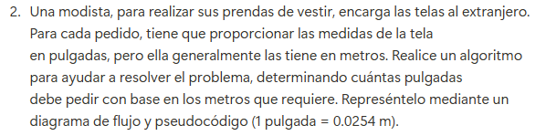

## Pasos:

**1-** Pedir las medidas en metros 

**2-** Usar factor de conversión para pasar de metros a pulgadas (1 pulgada = 0.0254 m)

**3-** Dividimos medidas entre 0.00254

**4-** Imprimimos nueva medida en pulgadas

### Diagrama de flujo

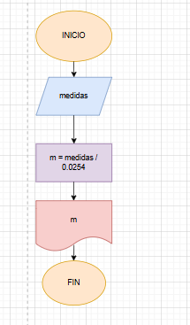

### Pseudocódigo

Inicio

    Escribir "Ingrese la cantidad de tela en metros:"
    Leer medidas
    m ← medidas / 0.0254
    Escribir "La cantidad de tela en pulgadas es:", m

Fin

3. 

## Pasos:

**1-** Pedir valor cateto A y cateto B

**2-** Sacar raiz cuadrada de la suma de los cuadrados de A y B

**3-** Imprimir C

### Diagrama de flujo

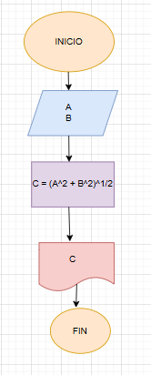

### Pseudocódigo

Inicio

    Escribir "Ingrese el valor del cateto A:"
    Leer A
    Escribir "Ingrese el valor del cateto B:"
    Leer B
    C ← (A^2 + B^2)^1/2
    Escribir "La hipotenusa del triángulo es:", C

Fin

4. 
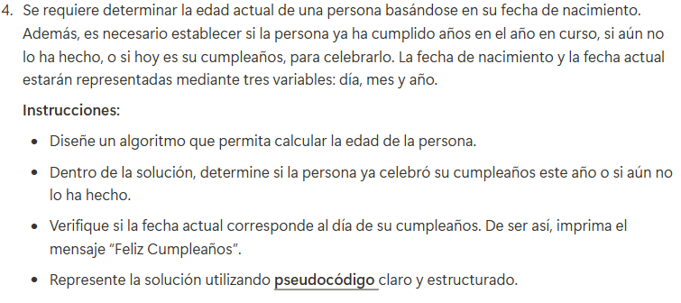

## Pasos:

**1-** Solicitamos la fecha de nacimiento (día, mes y año)

**2-** Solicitamos la fecha actual (día, mes y año)

**3-** Calculamos la edad inicial restando el año de nacimiento del año actual

**4-** Determinamos si ya cumplió años:

- Si el mes actual es menor al mes de nacimiento, significa que aún no ha cumplido años

- Si el mes es el mismo pero el día actual es menor, tampoco ha cumplido años

- Si el mes y el día coinciden, es su cumpleaños y se muestra un mensaje especial

- En cualquier otro caso, ya celebró su cumpleaños este año

**5-** Mostramos la edad calculada

### Pseudocódigo

INICIO

    // Pedir la fecha de nacimiento
    ESCRIBIR "Ingrese el día de nacimiento:"
    LEER dia_nac
    ESCRIBIR "Ingrese el mes de nacimiento:"
    LEER mes_nac
    ESCRIBIR "Ingrese el año de nacimiento:"
    LEER anio_nac

    // Pedir la fecha actual
    ESCRIBIR "Ingrese el día actual:"
    LEER dia_actual
    ESCRIBIR "Ingrese el mes actual:"
    LEER mes_actual
    ESCRIBIR "Ingrese el año actual:"
    LEER anio_actual

    // Calcular la edad inicial
    edad ← anio_actual - anio_nac

    // Verificar si la persona ya cumplió años o no
    SI (mes_actual < mes_nac) O (mes_actual = mes_nac Y dia_actual < dia_nac) ENTONCES
        edad ← edad - 1  // Aún no ha cumplido años este año
        ESCRIBIR "Aún no ha celebrado su cumpleaños este año."
    SINO SI (mes_actual = mes_nac Y dia_actual = dia_nac) ENTONCES
        ESCRIBIR "Feliz Cumpleaños!"
    SINO
        ESCRIBIR "Ya celebró su cumpleaños este año."
    FIN SI

    // Mostrar la edad calculada
    ESCRIBIR "Su edad actual es:", edad

FIN

5. 
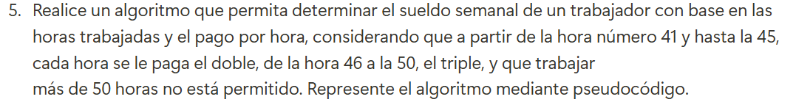

## Pasos:

**1-** Se piden al usuario las horas trabajadas y el pago por hora

**2-** Si las horas trabajdas son más de 50 se termina y se imprime "no está permitido"

**3-** Se define sueldo = 0 antes de empezar los cálculos

**4-** Se aplican las reglas según los rangos de horas trabajadas:
**Hasta 40 horas**: Pago normal
**41 a 45 horas**: Se pagan las primeras 40 normalmente y las extras al doble
**46 a 50 horas**: Se pagan las primeras 40 normalmente, las de 41 a 45 al doble y las de 46 a 50 al triple

**5-** Se imprime el sueldo calculado

### Diagrama de flujo

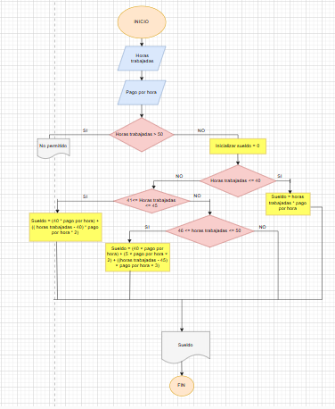

### Pseudocódigo

INICIO

    ESCRIBIR "Ingrese las horas trabajadas en la semana:"
    LEER horas_trabajadas
    ESCRIBIR "Ingrese el pago por hora:"
    LEER pago_por_hora

    SI horas_trabajadas > 50 ENTONCES
        ESCRIBIR "No se permite trabajar más de 50 horas."
    SINO
        sueldo ← 0  // Se inicia el sueldo en 0
        
        SI horas_trabajadas <= 40 ENTONCES
            sueldo ← horas_trabajadas * pago_por_hora
        SINO SI horas_trabajadas <= 45 ENTONCES
            sueldo ← (40 * pago_por_hora) + ((horas_trabajadas - 40) * pago_por_hora * 2)
        SINO 
            sueldo ← (40 * pago_por_hora) + (5 * pago_por_hora * 2) + ((horas_trabajadas - 45) * pago_por_hora * 3)
        FIN SI

        ESCRIBIR "El sueldo semanal es: ", sueldo
    FIN SI

FIN

6. 
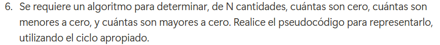

## Pasos:

**1-** El usuario ingresa cuántos números va a evaluar (se guarda en N)

**2-** Se preparan tres contadores (ceros, menores, mayores) para contar números iguales a cero, menores que cero y mayores que cero

**3-** Ciclo para ingresar números,se repite N veces:

El usuario ingresa un número

Si el número es 0 (ceros= ceros + 1)

Si es menor que 0 (menores = menores + 1)

Si es mayor que 0 (mayores = mayores + 1)

**4-** Imprimimos la cantidades de ceros, menores y mayores

### Diagrama de flujo

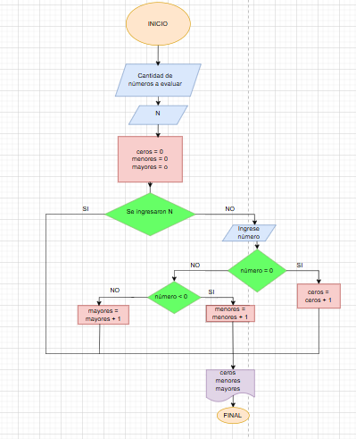

### Pseudocódigo

INICIO

    // Pedir la cantidad de números a evaluar
    Escribir "Ingrese la cantidad de números a evaluar: "
    Leer N

    // Inicializar contadores
    ceros ← 0
    menores ← 0
    mayores ← 0

    // Ciclo para ingresar los números
    Para i desde 1 hasta N hacer
        Escribir "Ingrese un número: "
        Leer numero

        Si numero = 0 Entonces
            ceros ← ceros + 1
        Sino 
            Si numero < 0 Entonces
                menores ← menores + 1
            Sino
                mayores ← mayores + 1
            FinSi
        FinSi
    FinPara

    // Mostrar resultados
    Escribir "Cantidad de ceros: ", ceros
    Escribir "Cantidad de menores a cero: ", menores
    Escribir "Cantidad de mayores a cero: ", mayores

FIN

7. 
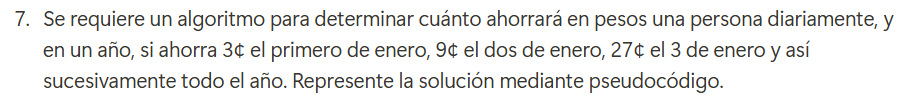

## Pasos:

**1-** Debemos calcular lo ahorrado en un año, sabiendo que cada día se triplica el ahorro del día anterior (3,9,27...)

**2-** Inicializamos ahorro_diario con 3 y ahorro_total con 0

**3-** Usamos un bucle for para recorrer los 365 días del año

**4-** Sumamos el ahorro_diario al ahorro_total

**5-** Multiplicamos ahorro_diario por 3 cada día que pasa

**6-** Imprimimos el ahorro_total

### Pseudocódigo

INICIO

    // Inicializar variables
    ahorro_diario = 3
    ahorro_total = 0

    // Recorrer los 365 días del año
    Para dia desde 1 hasta 365 hacer
        ahorro_total = ahorro_total + ahorro_diario
        ahorro_diario = ahorro_diario * 3 // Se triplica el ahorro cada día
    FinPara

    // Mostrar el ahorro total en centavos
    Escribir "El ahorro total en un año es: ", ahorro_total, " centavos"

FIN

8. 
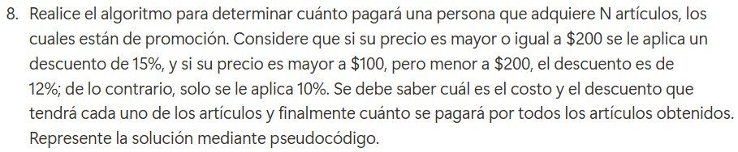

## Pasos:

**1-** Pedimos al usuario cuántos artículos (N) va a comprar.

**2-** Inicializamos total_a_pagar en 0 para acumular el costo total de los artículos.

**3-** Usamos un bucle For que se repite N veces (uno por cada artículo).

**4-** Pedimos al usuario que ingrese el precio del artículo actual.

**5-** Evaluamos en qué rango de precio se encuentra el artículo para aplicar el descuento:

Si el precio es mayor o igual a $200, se aplica un 15% de descuento

Si el precio es mayor a $100 pero menor a $200, se aplica un 12% de descuento

Si el precio es menor o igual a $100, se aplica un 10% de descuento

**6-** Calculamos el precio final restando el descuento al precio original.

**7-** Sumamos el precio con descuento al total_a_pagar.

**8-** Mostramos el descuento aplicado y el precio final del artículo.

**9-** Imprimimos total_a_pagar

### Pseudocódigo

INICIO

    // Solicitar la cantidad de artículos
    Escribir "Ingrese la cantidad de artículos: "
    Leer N

    total_a_pagar = 0

    // Recorrer cada artículo
    Para i desde 1 hasta N hacer
        Escribir "Ingrese el precio del artículo ", i, ": "
        Leer precio

        // Determinar el porcentaje de descuento
        Si precio >= 200 Entonces
            descuento = precio * 0.15
        Sino Si precio > 100 Entonces
            descuento = precio * 0.12
        Sino
            descuento = precio * 0.10
        FinSi

        // Calcular el precio con descuento
        precio_final = precio - descuento

        // Acumular el total a pagar
        total_a_pagar = total_a_pagar + precio_final

        // Mostrar información del artículo
        Escribir "Descuento aplicado: ", descuento
        Escribir "Precio final del artículo: ", precio_final
    FinPara

    // Mostrar el total a pagar por todos los artículos
    Escribir "El total a pagar por todos los artículos es: ", total_a_pagar

FIN

9. 
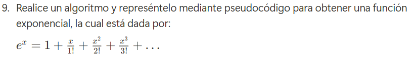

## Pasos:

**1-** Pedimos al usuario que ingrese el valor de x y el número de términos n que se usarán en la aproximación.

**2-** Inicializamos las variables necesarias:

resultado = 1.0 → Representa la suma total de la serie, comenzando con el primer término

potencia = 1.0 → Se usará para calcular x^i en cada iteración

factorial = 1.0 → Se usará para calcular i! en cada iteración

**3-** Usamos un bucle Para que repita el cálculo n-1 veces (ya que el primer término es 1 y ya está incluido)

**4-** Dentro del bucle:

Calculamos la potencia x^i multiplicando la potencia anterior por x

Calculamos el factorial i! multiplicando el factorial anterior por i

Calculamos el término de la serie como (x^i) / i!

Sumamos el término a resultado

**5-** Cuando el bucle termina, mostramos el valor aproximado de e^x con los términos calculados

### Pseudocódigo

Inicio

    // Pedir el valor de x y la cantidad de términos a considerar
    Escribir "Ingrese el valor de x:"
    Leer x
    Escribir "Ingrese el número de términos a considerar:"
    Leer n

    // Inicializar variables
    resultado = 1.0   // El primer término de la serie es 1
    potencia = 1.0    // Inicializar la potencia de x
    factorial = 1.0   // Inicializar el factorial

    // Calcular la serie de Taylor para e^x
    Para i = 1 Hasta n-1 Hacer
        potencia = potencia * x   // Calcular x^i
        factorial = factorial * i // Calcular i!
        termino = potencia / factorial  // Obtener el término de la serie
        resultado = resultado + termino  // Sumar el término al resultado
    Fin Para

    // Mostrar el resultado
    Escribir "El valor aproximado de e^", x, " es:", resultado

Fin  

10. 
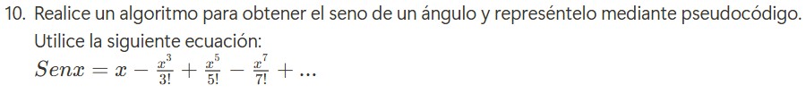

## Pasos:

**1-** Pedimos al usuario que ingrese un valor para x (el ángulo en radianes)

**2-** Pedimos al usuario cuántos términos quiere usar en la aproximación (más términos = mayor precisión)

**3-** Empezamos el cálculo con resultado = x, porque el primer número de la serie es x

**4-** Usamos variables auxiliares:

**potencia** = x, que nos ayuda a calcular las potencias de x

**factorial** = 1, para calcular los valores del factorial en el denominador

**signo** = -1, porque los términos se suman y restan alternadamente

**5-** Hacemos un bucle que repita el cálculo varias veces, dependiendo de cuántos términos pidió el usuario

**6-** En cada repetición del ciclo:

- Calculamos la potencia de x para el nuevo término

- Calculamos el factorial del número correspondiente

- Multiplicamos por signo para alternar sumas y restas

- Sumamos o restamos este valor al resultado

- Cambiamos signo para que en la siguiente repetición haga lo contrario

**7-** Cuando terminamos el ciclo, mostramos el valor calculado de sen(x)

### Pseudocódigo:

Inicio

    Escribir "Ingrese el valor de x (en radianes):"
    Leer x
    Escribir "Ingrese la cantidad de términos a usar:"
    Leer n

    resultado = x
    potencia = x
    factorial = 1
    signo = -1

    Para i = 1 Hasta n Hacer
        exponente = 2 * i + 1
        potencia = potencia * x * x
        factorial = factorial * exponente * (exponente - 1)
        termino = signo * (potencia / factorial)
        resultado = resultado + termino
        signo = signo * -1
    Fin Para

    Escribir "El valor aproximado de sen(", x, ") es:", resultado

Fin

## RETO FINAL 

Toma el pseudocódigo de los 5 primeros ejercicios del reto y realiza la traducción a Python

(Los códigos los realicé en google Colab)

1. 
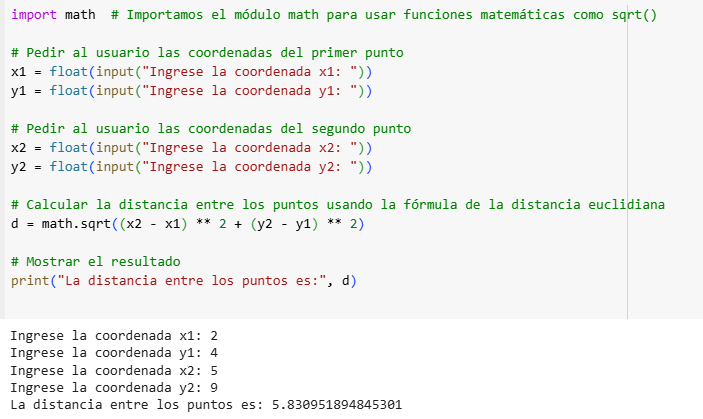

2. 
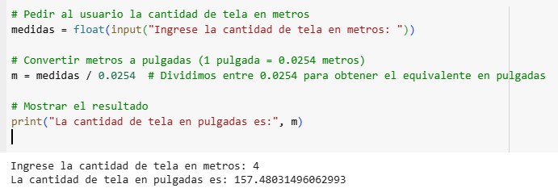

3. 
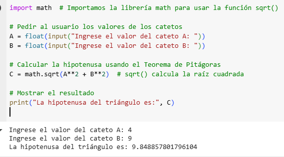

4. 
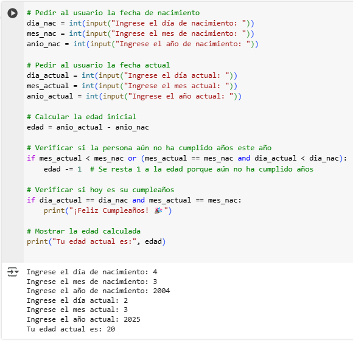

5. 
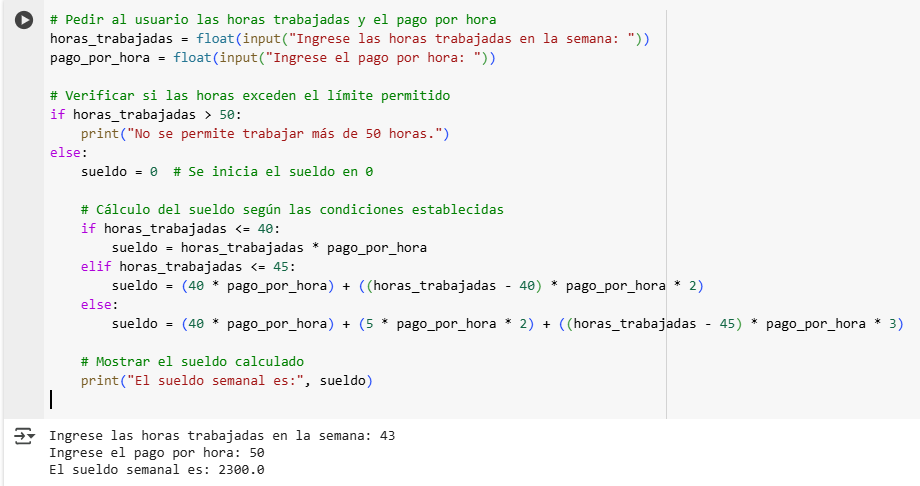