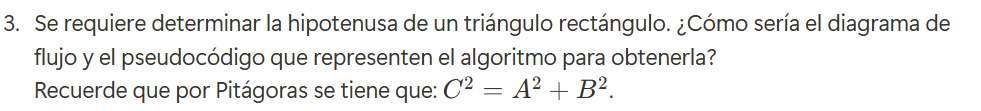

# Problemas
1. 

## Pasos:
 **1-** Pedir los puntos, inicial (x1,y1) y final (x2,y2)

 **2-** Obtener componentes x y y de la distancia (dx, dy), para eso restamos (x2-x1) y (y2-y1)

 **3-** Sacar raiz cuadrada a la suma de  las componentes al cuadrado (dx^2 + dy^2)^1/2

 **4-** Imprimir distancia

### Diagrama de flujo

### Pseudocódigo

Inicio

    Escribir "Ingrese las coordenadas del primer punto (x1, y1):"
    Leer x1, y1
    Escribir "Ingrese las coordenadas del segundo punto (x2, y2):"
    Leer x2, y2
    d ← sqrt((x2 - x1)^2 + (y2 - y1)^2)
    Escribir "La distancia entre los puntos es:", d

Fin

2. 

## Pasos:

**1-** Pedir las medidas en metros 

**2-** Usar factor de conversión para pasar de metros a pulgadas (1 pulgada = 0.0254 m)

**3-** Dividimos medidas entre 0.00254

**4-** Imprimimos nueva medida en pulgadas

### Diagrama de flujo

### Pseudocódigo

Inicio

    Escribir "Ingrese la cantidad de tela en metros:"
    Leer medidas
    m ← medidas / 0.0254
    Escribir "La cantidad de tela en pulgadas es:", m

Fin

3. 

## Pasos:

**1-** Pedir valor cateto A y cateto B

**2-** Sacar raiz cuadrada de la suma de los cuadrados de A y B

**3-** Imprimir C

### Diagrama de flujo

### Pseudocódigo

Inicio

    Escribir "Ingrese el valor del cateto A:"
    Leer A
    Escribir "Ingrese el valor del cateto B:"
    Leer B
    C ← (A^2 + B^2)^1/2
    Escribir "La hipotenusa del triángulo es:", C

Fin

4. 

## Pasos:

### Diagrama de flujo

### Pseudocódigo

5. 

## Pasos:

**1-** Se piden al usuario las horas trabajadas y el pago por hora

**2-** Si las horas trabajdas son más de 50 se termina y se imprime "no está permitido"

**3-** Se define sueldo = 0 antes de empezar los cálculos

**4-** Se aplican las reglas según los rangos de horas trabajadas:
**Hasta 40 horas**: Pago normal
**41 a 45 horas**: Se pagan las primeras 40 normalmente y las extras al doble
**46 a 50 horas**: Se pagan las primeras 40 normalmente, las de 41 a 45 al doble y las de 46 a 50 al triple

**5-** Se imprime el sueldo calculado

### Diagrama de flujo

# Pseudocódigo

INICIO

    ESCRIBIR "Ingrese las horas trabajadas en la semana:"
    LEER horas_trabajadas
    ESCRIBIR "Ingrese el pago por hora:"
    LEER pago_por_hora

    SI horas_trabajadas > 50 ENTONCES
        ESCRIBIR "No se permite trabajar más de 50 horas."
    SINO
        sueldo ← 0  // Se inicia el sueldo en 0
        
        SI horas_trabajadas <= 40 ENTONCES
            sueldo ← horas_trabajadas * pago_por_hora
        SINO SI horas_trabajadas <= 45 ENTONCES
            sueldo ← (40 * pago_por_hora) + ((horas_trabajadas - 40) * pago_por_hora * 2)
        SINO 
            sueldo ← (40 * pago_por_hora) + (5 * pago_por_hora * 2) + ((horas_trabajadas - 45) * pago_por_hora * 3)
        FIN SI

        ESCRIBIR "El sueldo semanal es: ", sueldo
    FIN SI

FIN

6. 

